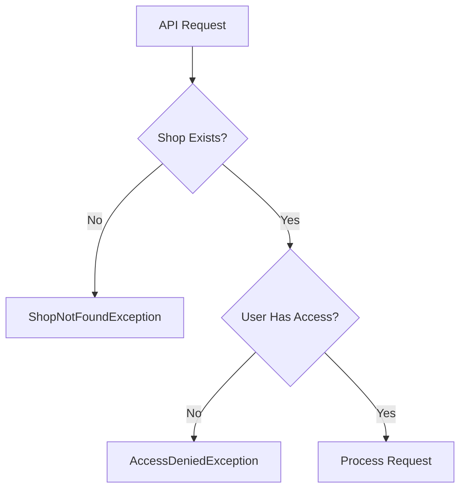

# Shop-Level Access Control Implementation Guide

## Overview

This document describes the shop-level access control system implemented in the Shop Manager application. The system ensures users can only access shops and data they have permission to view, based on their roles and assignments.

## Table of Contents

- [Architecture Overview](#architecture-overview)
- [Access Control Rules](#access-control-rules)
- [Core Components](#core-components)
- [Implementation Patterns](#implementation-patterns)
- [Testing](#testing)
- [Migration Guide](#migration-guide)

## Architecture Overview

The shop-level access control system is built on three key principles:

1. **Multi-tenant Isolation**: Complete separation of data at the tenant level
2. **Shop-level Permissions**: Granular access control at the shop level within tenants
3. **Role-based Access**: Different access levels based on user roles

### Access Hierarchy

```
SYSTEM_ADMIN (System-wide)
    └── All Tenants
        └── All Shops

TENANT_ADMIN/OWNER/INVESTOR (Tenant-wide)
    └── Tenant X
        └── All Shops in Tenant X

MANAGER/EMPLOYEE (Shop-specific)
    └── Assigned Shop Only
```

## Access Control Rules

### Role-Based Access Matrix

| Role | Access Level | Scope |
|------|-------------|-------|
| `SYSTEM_ADMIN` | System-wide | Access to all shops across all tenants |
| `TENANT_ADMIN` | Tenant-wide | Access to all shops within their tenant |
| `OWNER` | Tenant-wide | Access to all shops within their tenant |
| `INVESTOR` | Tenant-wide | Access to all shops within their tenant |
| `MANAGER` | Shop-specific | Access only to their assigned shop |
| `EMPLOYEE` | Shop-specific | Access only to their assigned shop |

### Access Validation Flow



## Core Components

### 1. ShopAccessValidator

**Location**: `com.princely.shopmanager.auth.security.ShopAccessValidator`

**Purpose**: Validates whether a user has access to a specific shop.

**Key Methods**:
```java
boolean hasAccess(String shopId, JwtPrincipal principal)
boolean hasNoAccessToShop(String shopId, JwtPrincipal principal)
boolean hasTenantWideAccess(JwtPrincipal principal)
```

**Example Usage**:
```java
if (shopAccessValidator.hasNoAccessToShop(shopId, principal)) {
    throw new AccessDeniedException("Access denied to shop: " + shopId);
}
```

### 2. ShopAwareService

**Location**: `com.princely.shopmanager.shared.service.ShopAwareService`

**Purpose**: Abstract base class providing standardized shop access validation and filtering.

**Key Methods**:
```java
protected void validateShopAccess(String shopId, JwtPrincipal principal)
protected FilterScope getFilterScope(JwtPrincipal principal)
```

**Example Usage**:
```java
@Service
public class ProductService extends ShopAwareService {

    public ProductResponse getProduct(String productId, JwtPrincipal principal) {
        Product product = findProductForUser(productId, principal);
        return toResponse(product);
    }

    private Product findProductForUser(String productId, JwtPrincipal principal) {
        Product product = productRepository.findById(productId)
            .orElseThrow(() -> new EntityNotFoundException("Product not found"));

        validateShopAccess(product.getShop().getId(), principal);
        return product;
    }
}
```

### 3. ShopAware Interface

**Location**: `com.princely.shopmanager.shared.domain.ShopAware`

**Purpose**: Marker interface for entities that belong to a shop.

**Example Implementation**:
```java
@Entity
public class Product implements ShopAware {

    @ManyToOne(fetch = FetchType.LAZY)
    @JoinColumn(name = "shop_id", nullable = false)
    private Shop shop;

    @Override
    public String getShopId() {
        return shop != null ? shop.getId() : null;
    }
}
```

### 4. FilterScope

**Location**: `com.princely.shopmanager.shared.service.ShopAwareService.FilterScope`

**Purpose**: Defines the scope of data filtering based on user roles.

**Filter Levels**:
- `SYSTEM_WIDE`: No filtering (SYSTEM_ADMIN)
- `TENANT_WIDE`: Filter by tenant ID (TENANT_ADMIN, OWNER, INVESTOR)
- `SHOP_SPECIFIC`: Filter by shop ID (MANAGER, EMPLOYEE, etc.)

**Example Usage**:
```java
public Page<Receipt> findAllReceipts(String shopId, Pageable pageable, JwtPrincipal principal) {
    FilterScope filterScope = getFilterScope(principal);

    if (filterScope.isSystemWide()) {
        return receiptRepository.findAll(pageable);
    } else if (filterScope.isTenantWide()) {
        return findByTenantId(filterScope.getTenantId(), pageable);
    } else {
        return findByShopId(filterScope.getShopId(), pageable);
    }
}
```

## Implementation Patterns

### Pattern 1: Service Method with Shop Validation

```java
@Service
public class InventoryService extends ShopAwareService {

    public InventoryResponse getInventoryById(String inventoryId, JwtPrincipal principal) {
        // Find entity
        Inventory inventory = inventoryRepository.findById(inventoryId)
            .orElseThrow(() -> new EntityNotFoundException("Inventory not found"));

        // Validate shop access
        validateShopAccess(inventory.getShop().getId(), principal);

        // Return response
        return toResponse(inventory);
    }
}
```

### Pattern 2: Helper Method for Type-Safe Validation

```java
private Product findProductForUser(String productId, JwtPrincipal principal) {
    Product product = productRepository.findById(productId)
        .orElseThrow(() -> new EntityNotFoundException("Product not found"));

    validateShopAccess(product.getShop().getId(), principal);
    return product;
}

public ProductResponse updateProduct(String productId, ProductUpdateRequest request, JwtPrincipal principal) {
    Product product = findProductForUser(productId, principal);
    // Update logic...
}
```

### Pattern 3: Scope-Based Filtering for List Operations

```java
public Page<Product> getProducts(String shopId, Specification<Product> spec,
                                  Pageable pageable, boolean includeInventory,
                                  JwtPrincipal principal) {
    FilterScope filterScope = getFilterScope(principal);

    Specification<Product> finalSpec = spec;

    if (shopId != null && !shopId.trim().isEmpty()) {
        validateShopAccess(shopId, principal);
        finalSpec = finalSpec.and((root, query, cb) ->
            cb.equal(root.get("shop").get("id"), shopId));
    } else if (filterScope.isTenantWide()) {
        finalSpec = finalSpec.and((root, query, cb) ->
            cb.equal(root.get("shop").get("tenant").get("id"), filterScope.getTenantId()));
    } else if (filterScope.isShopSpecific()) {
        finalSpec = finalSpec.and((root, query, cb) ->
            cb.equal(root.get("shop").get("id"), filterScope.getShopId()));
    }

    return productRepository.findAll(finalSpec, pageable);
}
```

### Pattern 4: Controller Integration

```java
@RestController
@RequestMapping("/api/shops/{shopId}/products")
public class ProductController {

    @GetMapping("/{productId}")
    public ResponseEntity<ProductResponse> getProduct(
            @PathVariable String shopId,
            @PathVariable String productId,
            @AuthenticationPrincipal JwtPrincipal principal) {

        ProductResponse product = productService.getProduct(productId, principal);
        return ResponseEntity.ok(product);
    }
}
```

## Testing

### Unit Test Setup

```java
@ExtendWith(MockitoExtension.class)
class ProductServiceTest {

    @Mock
    private ProductRepository productRepository;

    @Mock
    private ShopRepository shopRepository;

    @Mock
    private ShopAccessValidator shopAccessValidator;

    private ProductService productService;
    private JwtPrincipal testPrincipal;

    @BeforeEach
    void setUp() {
        testPrincipal = JwtPrincipal.builder()
            .subject("test-user")
            .preferredUsername("testuser")
            .roles(List.of("MANAGER"))
            .tenantId("tenant-1")
            .shopId("shop-1")
            .build();

        // Mock shop existence check
        lenient().when(shopRepository.existsById("shop-1")).thenReturn(true);

        productService = new ProductService(
            shopAccessValidator,
            shopRepository,
            productRepository,
            // other dependencies...
        );
    }

    @Test
    void getProduct_WithValidAccess_ShouldReturnProduct() {
        // Arrange
        when(productRepository.findById("product-1")).thenReturn(Optional.of(testProduct));
        when(shopAccessValidator.hasNoAccessToShop("shop-1", testPrincipal)).thenReturn(false);

        // Act
        ProductResponse result = productService.getProduct("product-1", testPrincipal);

        // Assert
        assertThat(result).isNotNull();
        assertThat(result.getId()).isEqualTo("product-1");
    }
}
```

### Integration Test Setup

```java
@DirtiesContext(classMode = DirtiesContext.ClassMode.AFTER_EACH_TEST_METHOD)
@DisplayName("Shop Access Control Integration Tests")
class ShopAccessControlIT extends IntegrationTestBase {

    @Autowired
    private ShopAccessValidator shopAccessValidator;

    @Test
    @DisplayName("SYSTEM_ADMIN should have access to all shops")
    void systemAdminShouldHaveAccessToAllShops() {
        JwtPrincipal systemAdmin = createPrincipal("admin", SecurityRoles.SYSTEM_ADMIN, null, null);

        assertThat(shopAccessValidator.hasAccess(shop1.getId(), systemAdmin)).isTrue();
        assertThat(shopAccessValidator.hasAccess(shop2.getId(), systemAdmin)).isTrue();
    }

    @Test
    @DisplayName("MANAGER should only have access to assigned shop")
    void managerShouldOnlyHaveAccessToAssignedShop() {
        JwtPrincipal manager = createPrincipal("manager", SecurityRoles.MANAGER, "tenant-1", "shop-1");

        assertThat(shopAccessValidator.hasAccess("shop-1", manager)).isTrue();
        assertThat(shopAccessValidator.hasAccess("shop-2", manager)).isFalse();
    }
}
```

## Migration Guide

### Updating Existing Services

1. **Extend ShopAwareService**:
```java
// Before
@Service
public class MyService {
    // ...
}

// After
@Service
public class MyService extends ShopAwareService {

    public MyService(ShopAccessValidator shopAccessValidator,
                     ShopRepository shopRepository,
                     // other dependencies...) {
        super(shopAccessValidator, shopRepository);
        // initialize other dependencies...
    }
}
```

2. **Add JwtPrincipal parameter to methods**:
```java
// Before
public MyResponse getMyEntity(String entityId) {
    // ...
}

// After
public MyResponse getMyEntity(String entityId, JwtPrincipal principal) {
    MyEntity entity = findEntityForUser(entityId, principal);
    // ...
}

private MyEntity findEntityForUser(String entityId, JwtPrincipal principal) {
    MyEntity entity = repository.findById(entityId)
        .orElseThrow(() -> new EntityNotFoundException("Entity not found"));

    validateShopAccess(entity.getShop().getId(), principal);
    return entity;
}
```

3. **Update Controllers**:
```java
// Before
@GetMapping("/{id}")
public ResponseEntity<MyResponse> get(@PathVariable String id) {
    return ResponseEntity.ok(myService.getMyEntity(id));
}

// After
@GetMapping("/{id}")
public ResponseEntity<MyResponse> get(
        @PathVariable String id,
        @AuthenticationPrincipal JwtPrincipal principal) {
    return ResponseEntity.ok(myService.getMyEntity(id, principal));
}
```

4. **Update Unit Tests**:
```java
// Add mocks
@Mock
private ShopAccessValidator shopAccessValidator;

@Mock
private ShopRepository shopRepository;

// Add principal
private JwtPrincipal testPrincipal;

@BeforeEach
void setUp() {
    testPrincipal = JwtPrincipal.builder()
        .subject("test-user")
        .preferredUsername("testuser")
        .roles(List.of("MANAGER"))
        .tenantId("tenant-1")
        .shopId("shop-1")
        .build();

    // Mock shop existence
    lenient().when(shopRepository.existsById("shop-1")).thenReturn(true);

    // Manual service instantiation
    myService = new MyService(
        shopAccessValidator,
        shopRepository,
        // other dependencies...
    );
}

// Update test methods
@Test
void testMethod() {
    when(shopAccessValidator.hasNoAccessToShop("shop-1", testPrincipal)).thenReturn(false);

    MyResponse result = myService.getMyEntity("entity-1", testPrincipal);

    assertThat(result).isNotNull();
}
```

## Security Considerations

1. **Always validate shop access** before processing entity operations
2. **Use helper methods** to encapsulate entity retrieval and validation
3. **Apply scope-based filtering** for list operations to prevent data leakage
4. **Test access control** thoroughly with different user roles
5. **Never bypass validation** even for "trusted" operations

## Performance Considerations

1. **Shop existence check** is optimized using `existsById()` instead of `findById()`
2. **FilterScope** is determined once per request and reused
3. **Database queries** include shop/tenant filters at the database level
4. **Lazy loading** is used for shop relationships to minimize data transfer

## Common Pitfalls

1. ❌ **Forgetting to add principal parameter**:
```java
// Wrong
public MyResponse get(String id) { ... }

// Correct
public MyResponse get(String id, JwtPrincipal principal) { ... }
```

2. ❌ **Validating after operation**:
```java
// Wrong
MyEntity entity = repository.save(newEntity);
validateShopAccess(entity.getShop().getId(), principal);

// Correct
validateShopAccess(shopId, principal);
MyEntity entity = repository.save(newEntity);
```

3. ❌ **Not using helper methods**:
```java
// Wrong - duplicated validation logic
public void update(String id, UpdateRequest request, JwtPrincipal principal) {
    MyEntity entity = repository.findById(id)
        .orElseThrow(() -> new EntityNotFoundException("Not found"));
    validateShopAccess(entity.getShop().getId(), principal);
    // update logic...
}

public void delete(String id, JwtPrincipal principal) {
    MyEntity entity = repository.findById(id)
        .orElseThrow(() -> new EntityNotFoundException("Not found"));
    validateShopAccess(entity.getShop().getId(), principal);
    // delete logic...
}

// Correct - reusable helper method
private MyEntity findEntityForUser(String id, JwtPrincipal principal) {
    MyEntity entity = repository.findById(id)
        .orElseThrow(() -> new EntityNotFoundException("Not found"));
    validateShopAccess(entity.getShop().getId(), principal);
    return entity;
}

public void update(String id, UpdateRequest request, JwtPrincipal principal) {
    MyEntity entity = findEntityForUser(id, principal);
    // update logic...
}

public void delete(String id, JwtPrincipal principal) {
    MyEntity entity = findEntityForUser(id, principal);
    // delete logic...
}
```

## Related Documentation

- [PERMISSION_MATRIX.md](./PERMISSION_MATRIX.md) - Complete permission matrix
- [TESTING-GUIDE.md](../TESTING-GUIDE.md) - Testing strategies
- [DEVELOPER_GUIDE.md](../DEVELOPER_GUIDE.md) - Development guidelines

## Support

For questions or issues related to shop-level access control:
1. Review this documentation
2. Check existing test cases for examples
3. Consult the architecture tests in `ArchitectureTest.java`
4. Review integration tests in `ShopAccessControlIT.java`
