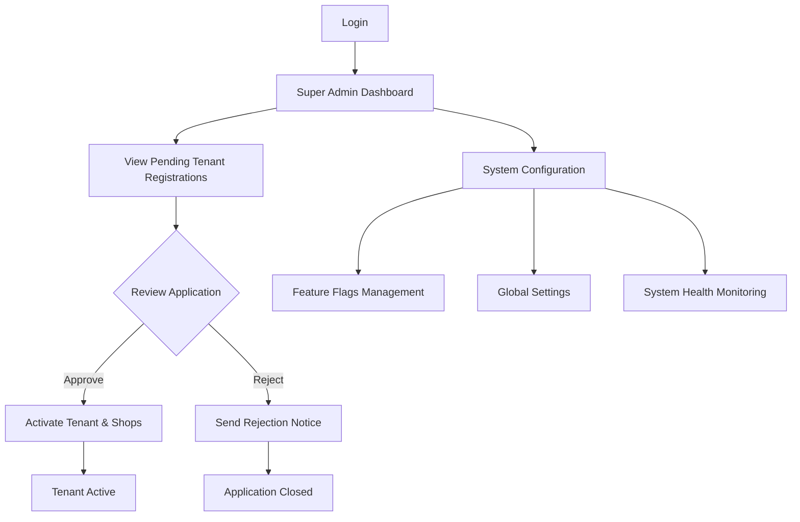
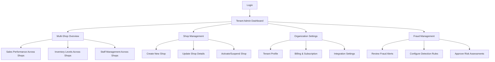
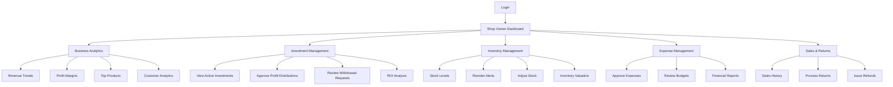
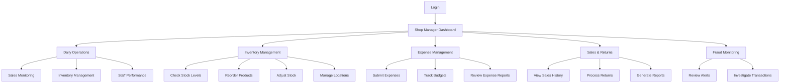
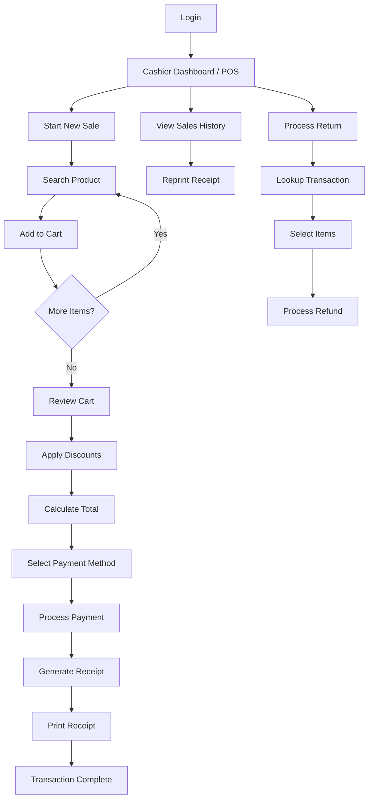
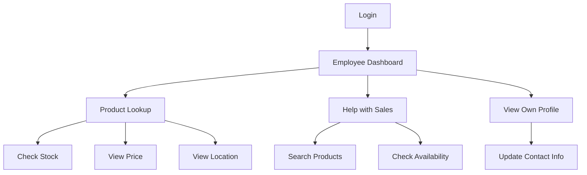
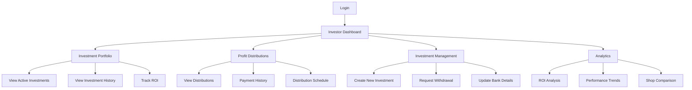
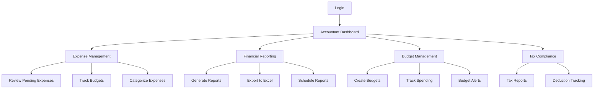

# Shop Manager - User Journey Map & Screen Inventory

**Version**: 1.0
**Last Updated**: January 2025
**Purpose**: Complete user journey documentation for UI/UX designers and React frontend developers

---

## Table of Contents

1. [Overview](#overview)
2. [User Roles Summary](#user-roles-summary)
3. [User Journey Flows](#user-journey-flows)
   - [Super Admin Journey](#super-admin-journey)
   - [Tenant Admin Journey](#tenant-admin-journey)
   - [Shop Owner Journey](#shop-owner-journey)
   - [Shop Manager Journey](#shop-manager-journey)
   - [Cashier Journey](#cashier-journey)
   - [Shop Employee Journey](#shop-employee-journey)
   - [Investor Journey](#investor-journey)
   - [Accountant Journey](#accountant-journey)
4. [Complete Screen Inventory](#complete-screen-inventory)
5. [API-to-Screen Mapping](#api-to-screen-mapping)
6. [Navigation Hierarchy](#navigation-hierarchy)
7. [Figma Design Structure](#figma-design-structure)

---

## Overview

Shop Manager is a multi-tenant retail management platform with **8 distinct user roles**, each with specialized workflows and screens. This document provides:

- **User journey flows** for each role
- **Screen specifications** with required APIs
- **Navigation patterns** and entry points
- **Design recommendations** for Figma implementation

### Key Metrics
- **Total Screens**: 75+ unique screens
- **User Roles**: 8 primary roles
- **API Endpoints**: 100+ REST endpoints
- **Modules**: 11 functional modules

---

## User Roles Summary

| Role | Primary Function | Access Level | Key Screens |
|------|-----------------|--------------|-------------|
| **Super Admin** | Platform management, tenant approval | System-wide | Tenant approval dashboard, system settings |
| **Tenant Admin** | Organization management, multi-shop oversight | Tenant-level | Multi-shop dashboard, organization settings |
| **Shop Owner** | Business strategy, financial oversight | Shop-level (full access) | Business analytics, investment management |
| **Shop Manager** | Daily operations, team management | Shop-level (operational) | Sales dashboard, inventory management |
| **Cashier** | Point of sale, customer transactions | Shop-level (limited) | POS interface, receipt printing |
| **Shop Employee** | Sales support, inventory assistance | Shop-level (minimal) | Product lookup, stock check |
| **Investor** | Investment tracking, ROI monitoring | Tenant-level (financial) | Investment portfolio, distribution tracking |
| **Accountant** | Financial reporting, expense management | Tenant-level (financial) | Financial reports, expense analytics |

---

## User Journey Flows

### Super Admin Journey

**Role Description**: Platform-level administrator responsible for tenant onboarding and system configuration.

#### Primary Workflows



#### Entry Points
1. **Login Page** → Keycloak authentication with SUPER_ADMIN role
2. **Direct URL**: `/admin/dashboard`

#### Key User Stories

**Story 1: Approve New Tenant**
```
As a Super Admin,
I want to review and approve tenant registration applications,
So that new organizations can start using the platform.

Steps:
1. Navigate to "Pending Registrations" tab
2. View application details (company info, contact user, proposed shops)
3. Review business registration documents
4. Click "Approve" or "Reject" with reason
5. System activates tenant, creates admin user, enables selected shops
6. Confirmation email sent to tenant contact
```

**Story 2: Monitor System Health**
```
As a Super Admin,
I want to monitor system health and performance metrics,
So that I can ensure platform stability.

Steps:
1. View system dashboard with key metrics
2. Check tenant count, active users, transaction volume
3. Review error logs and alerts
4. Access detailed health checks per service
```

#### Required Screens

| Screen Name | Path | API Endpoints | Key Components |
|-------------|------|---------------|----------------|
| **Super Admin Dashboard** | `/admin/dashboard` | - | System metrics cards, recent activity feed |
| **Pending Tenant List** | `/admin/tenants/pending` | `GET /api/v1/admin/tenants/pending` | Data table with filters, status badges |
| **Tenant Application Detail** | `/admin/tenants/:tenantId` | `GET /api/v1/admin/tenants/{tenantId}` | Application form review, document viewer |
| **Tenant Activation Modal** | Modal overlay | `POST /api/v1/admin/tenants/{tenantId}/activate` | Shop selection, approval form |
| **System Settings** | `/admin/settings` | - | Feature flag toggles, configuration forms |

---

### Tenant Admin Journey

**Role Description**: Organization administrator managing multiple shops, users, and tenant-wide operations.

#### Primary Workflows



#### Entry Points
1. **Login Page** → Keycloak authentication with TENANT_ADMIN role
2. **Default Landing**: `/dashboard` (multi-shop view)

#### Key User Stories

**Story 1: Create New Shop**
```
As a Tenant Admin,
I want to create a new shop location,
So that I can expand my business to new locations.

Steps:
1. Navigate to "Shops" → "Create New Shop"
2. Fill in shop details (name, address, contact info, tax ID)
3. Upload shop logo (optional)
4. Configure shop-specific settings (opening hours, currency)
5. Assign initial staff members
6. Set shop status (active/inactive)
7. Submit for creation
8. Shop is created and added to tenant's shop list
```

**Story 2: Monitor Cross-Shop Performance**
```
As a Tenant Admin,
I want to view consolidated performance metrics across all my shops,
So that I can identify top performers and areas needing attention.

Steps:
1. View dashboard with shop comparison table
2. Review key metrics: revenue, transactions, profit margins
3. Filter by date range, shop status
4. Click on specific shop to drill down into details
5. Export consolidated report
```

**Story 3: Manage Fraud Detection**
```
As a Tenant Admin,
I want to review and respond to fraud alerts across all shops,
So that I can protect my business from fraudulent activities.

Steps:
1. Navigate to "Fraud Management" dashboard
2. View alert summary (high/medium/low severity)
3. Filter alerts by shop, date, alert type
4. Click on alert to view details
5. Acknowledge, resolve, or mark as false positive
6. Configure fraud detection rules
7. Approve pending risk assessments
```

#### Required Screens

| Screen Name | Path | API Endpoints | Key Components |
|-------------|------|---------------|----------------|
| **Tenant Admin Dashboard** | `/dashboard` | `GET /api/shops`, `GET /api/analytics/sales-summary` | Multi-shop cards, performance charts |
| **Shop List** | `/shops` | `GET /api/shops` | Paginated table, filters, status badges |
| **Create Shop** | `/shops/create` | `POST /api/shops` | Multi-step form, address autocomplete |
| **Shop Detail** | `/shops/:shopId` | `GET /api/shops/{shopId}` | Shop info, staff list, recent activity |
| **Edit Shop** | `/shops/:shopId/edit` | `PUT /api/shops/{shopId}` | Form with validation |
| **Shop Status Management** | `/shops/:shopId` | `PATCH /api/shops/{shopId}/status` | Status dropdown, confirmation modal |
| **Fraud Dashboard** | `/fraud` | `GET /api/v1/fraud/alerts` | Alert cards, severity indicators |
| **Fraud Alert Detail** | `/fraud/alerts/:alertId` | `GET /api/v1/fraud/alerts/{alertId}` | Alert details, action buttons |
| **Fraud Rules Management** | `/fraud/rules` | `GET /api/v1/fraud/rules`, `POST /api/v1/fraud/rules` | Rule list, rule builder form |
| **Risk Assessment List** | `/fraud/risk-assessments` | `GET /api/v1/fraud/risk-assessments` | Assessment cards, approval workflow |
| **Tenant Settings** | `/settings/organization` | - | Tenant profile form, integration configs |

---

### Shop Owner Journey

**Role Description**: Business owner with full operational and financial control over a shop.

#### Primary Workflows



#### Entry Points
1. **Login Page** → Keycloak authentication with SHOP_OWNER role
2. **Default Landing**: `/dashboard` (shop owner view)

#### Key User Stories

**Story 1: Review and Approve Investment Distribution**
```
As a Shop Owner,
I want to review and approve calculated profit distributions for investors,
So that I can ensure accurate payment of investment returns.

Steps:
1. Navigate to "Investments" → "Distributions"
2. View pending distributions list
3. Click on distribution to review calculation details
4. Verify profit calculation based on investment terms
5. Approve distribution for payment
6. Enter payment reference after processing payment
7. Mark distribution as paid
8. System sends notification to investor
```

**Story 2: Analyze Business Performance**
```
As a Shop Owner,
I want to view comprehensive business analytics,
So that I can make data-driven decisions about my shop.

Steps:
1. View dashboard with key performance indicators
2. Review revenue trends over time (daily, weekly, monthly)
3. Analyze product performance (top sellers, slow movers)
4. Check inventory turnover rates
5. Review expense trends and budget adherence
6. Compare performance against previous periods
7. Export reports for external analysis
```

**Story 3: Manage Fraud Alerts**
```
As a Shop Owner,
I want to review and respond to fraud alerts,
So that I can protect my business from losses.

Steps:
1. Receive notification of new fraud alert
2. Navigate to fraud dashboard
3. Review alert details (transaction info, risk factors)
4. Investigate transaction with staff
5. Resolve alert with outcome (confirmed fraud, false positive)
6. Document resolution notes
7. Update fraud detection rules if needed
```

#### Required Screens

| Screen Name | Path | API Endpoints | Key Components |
|-------------|------|---------------|----------------|
| **Shop Owner Dashboard** | `/dashboard` | `GET /api/analytics/*` | KPI cards, revenue charts, alerts |
| **Business Analytics** | `/analytics` | `GET /api/analytics/sales-summary`, `GET /api/analytics/revenue-analytics` | Line charts, bar charts, data tables |
| **Investment Portfolio** | `/investments` | `GET /api/v1/shops/{shopId}/investments` | Investment cards, ROI metrics |
| **Investment Detail** | `/investments/:investmentId` | `GET /api/v1/investments/{investmentId}` | Investment info, distribution history |
| **Distribution Management** | `/investments/distributions` | `GET /api/v1/investments/{investmentId}/distributions` | Distribution list, approval workflow |
| **Approve Distribution** | Modal | `POST /api/v1/distributions/{distributionId}/approve` | Approval form, notes field |
| **Mark Distribution Paid** | Modal | `POST /api/v1/distributions/{distributionId}/mark-paid` | Payment reference input |
| **Inventory Dashboard** | `/inventory` | `GET /api/v1/shops/{shopId}/inventory` | Stock level cards, reorder alerts |
| **Inventory Detail** | `/inventory/:inventoryId` | `GET /api/v1/inventory/{inventoryId}` | Product details, stock history |
| **Stock Adjustment** | Modal | `PUT /api/v1/inventory/{inventoryId}/adjust-stock` | Adjustment form, reason dropdown |
| **Expense Approval** | `/expenses/approvals` | `GET /api/v1/shops/{shopId}/expenses?status=PENDING` | Expense cards, approval buttons |
| **Returns Management** | `/returns` | `GET /api/shops/{shopId}/returns` | Return list, status filters |
| **Process Return** | `/returns/:returnId` | `POST /api/shops/{shopId}/returns/{returnId}/process` | Return form, refund calculation |

---

### Shop Manager Journey

**Role Description**: Operational manager responsible for day-to-day shop activities, staff supervision, and operational decisions.

#### Primary Workflows



#### Entry Points
1. **Login Page** → Keycloak authentication with SHOP_MANAGER role
2. **Default Landing**: `/dashboard` (shop manager view)

#### Key User Stories

**Story 1: Manage Daily Inventory**
```
As a Shop Manager,
I want to monitor and adjust inventory levels,
So that I ensure product availability without overstocking.

Steps:
1. View inventory dashboard with stock status
2. Check low stock alerts (items below reorder level)
3. Review expiring items (items nearing expiry date)
4. Click on product to view detailed inventory
5. Adjust stock levels with reason (damaged, shrinkage, found stock)
6. Reserve stock for pending orders
7. Release reserved stock if order cancelled
8. Generate inventory report
```

**Story 2: Process Product Return**
```
As a Shop Manager,
I want to process customer product returns,
So that I can maintain customer satisfaction and update inventory.

Steps:
1. Customer brings product for return
2. Open returns interface
3. Search for original transaction by receipt number
4. Select product(s) being returned
5. Verify return condition (new, opened, damaged)
6. Enter return reason
7. Calculate refund amount (full, partial, store credit)
8. Process refund
9. Update inventory (restock if sellable)
10. Generate return receipt
```

**Story 3: Review Fraud Alerts**
```
As a Shop Manager,
I want to review fraud alerts for my shop,
So that I can investigate and prevent fraudulent activities.

Steps:
1. View fraud alerts dashboard
2. Filter by severity and date
3. Click on high-priority alert
4. Review transaction details
5. Check for patterns (multiple returns, excessive discounts)
6. Acknowledge alert and assign for investigation
7. Document findings
8. Resolve alert with outcome
```

#### Required Screens

| Screen Name | Path | API Endpoints | Key Components |
|-------------|------|---------------|----------------|
| **Shop Manager Dashboard** | `/dashboard` | `GET /api/analytics/sales-summary` | Daily sales, inventory alerts, staff metrics |
| **Inventory List** | `/inventory` | `GET /api/v1/shops/{shopId}/inventory` | Paginated table, filters, search |
| **Inventory Detail** | `/inventory/:inventoryId` | `GET /api/v1/inventory/{inventoryId}` | Product info, stock levels, history |
| **Stock Adjustment Modal** | Modal | `PUT /api/v1/inventory/{inventoryId}/adjust-stock` | Adjustment form, reason codes |
| **Low Stock Report** | `/inventory/low-stock` | `GET /api/v1/shops/{shopId}/inventory/low-stock` | Alert list, reorder suggestions |
| **Expiring Items Report** | `/inventory/expiring` | `GET /api/v1/shops/{shopId}/inventory/expiring` | Expiry list, date filters |
| **Returns List** | `/returns` | `GET /api/shops/{shopId}/returns` | Return cards, status filters |
| **Create Return** | `/returns/create` | `POST /api/shops/{shopId}/returns` | Return form, transaction lookup |
| **Process Return** | `/returns/:returnId/process` | `POST /api/shops/{shopId}/returns/{returnId}/process` | Refund calculation, inventory update |
| **Expense List** | `/expenses` | `GET /api/v1/shops/{shopId}/expenses` | Expense table, filters, search |
| **Create Expense** | `/expenses/create` | `POST /api/v1/shops/{shopId}/expenses` | Expense form, receipt upload |
| **Sales History** | `/sales/history` | - | Sales table, date filters, export |
| **Fraud Alerts** | `/fraud/alerts` | `GET /api/v1/fraud/alerts` | Alert cards, severity badges |

---

### Cashier Journey

**Role Description**: Front-line staff handling point-of-sale transactions, customer service, and receipt generation.

#### Primary Workflows



#### Entry Points
1. **Login Page** → Keycloak authentication with CASHIER role
2. **Default Landing**: `/pos` (point of sale interface)

#### Key User Stories

**Story 1: Complete a Sale Transaction**
```
As a Cashier,
I want to process a customer sale quickly and accurately,
So that I can provide efficient service.

Steps:
1. Start new sale transaction
2. Scan product barcode or search by name/SKU
3. Verify product details and price
4. Add quantity to cart
5. Repeat for all items
6. Apply customer discount if applicable
7. Review cart totals
8. Select payment method (cash, card, mobile)
9. Process payment
10. Generate receipt automatically
11. Print receipt
12. Optionally email receipt to customer
13. Complete transaction
```

**Story 2: Process Quick Return**
```
As a Cashier,
I want to process product returns quickly,
So that I can handle customer service efficiently.

Steps:
1. Open returns interface
2. Scan receipt barcode or enter receipt number
3. System loads original transaction
4. Select items being returned
5. Verify item condition
6. System calculates refund amount
7. Select refund method (original payment, store credit)
8. Process refund
9. Generate return receipt
10. Update inventory
```

**Story 3: Reprint Receipt**
```
As a Cashier,
I want to reprint a receipt for a customer,
So that I can help customers who lost their receipt.

Steps:
1. Navigate to "Sales History"
2. Search for transaction by date, receipt number, or amount
3. Select transaction
4. View receipt details
5. Click "Print Receipt"
6. Receipt is reprinted
```

#### Required Screens

| Screen Name | Path | API Endpoints | Key Components |
|-------------|------|---------------|----------------|
| **Cashier Dashboard / POS** | `/pos` | - | Quick stats, active cart, recent transactions |
| **Product Search** | Component in POS | - | Search input, product suggestions |
| **Shopping Cart** | Component in POS | - | Cart items, quantity controls, totals |
| **Payment Modal** | Modal | - | Payment method selection, amount tendered |
| **Receipt Preview** | Modal | `POST /api/receipts/generate/{transactionId}` | Receipt content, print/email buttons |
| **Sales History** | `/sales/history` | - | Transaction list, search filters |
| **Transaction Detail** | `/sales/:transactionId` | - | Transaction details, line items, receipt |
| **Reprint Receipt** | Modal | `GET /api/receipts/{receiptId}/printable` | Receipt content, reprint button |
| **Returns Interface** | `/returns/create` | `POST /api/shops/{shopId}/returns` | Transaction lookup, item selection |
| **Refund Processing** | Modal | - | Refund calculation, payment method |

---

### Shop Employee Journey

**Role Description**: Support staff with limited access for sales assistance and basic inventory queries.

#### Primary Workflows



#### Entry Points
1. **Login Page** → Keycloak authentication with SHOP_EMPLOYEE role
2. **Default Landing**: `/dashboard` (simplified view)

#### Key User Stories

**Story 1: Help Customer Find Product**
```
As a Shop Employee,
I want to quickly search for product availability,
So that I can assist customers on the shop floor.

Steps:
1. Customer asks about product availability
2. Open product search on mobile/tablet
3. Search by product name or barcode
4. View product details:
   - Available quantity
   - Location in shop
   - Price
   - Product description
5. Inform customer
6. Optionally reserve item if customer requests
```

**Story 2: Check Stock Levels**
```
As a Shop Employee,
I want to check stock levels for multiple products,
So that I can inform customers about availability.

Steps:
1. Navigate to inventory view
2. Search for products
3. View stock status (in stock, low stock, out of stock)
4. Check reserved quantities
5. View expected restock date if out of stock
```

#### Required Screens

| Screen Name | Path | API Endpoints | Key Components |
|-------------|------|---------------|----------------|
| **Employee Dashboard** | `/dashboard` | - | Simplified view, quick actions |
| **Product Search** | `/products/search` | - | Search interface, product cards |
| **Product Detail** | `/products/:productId` | - | Product info, stock level, location |
| **Inventory View** | `/inventory` | `GET /api/v1/shops/{shopId}/inventory` | Read-only inventory list |
| **Profile Page** | `/profile` | `GET /api/users/profile` | User profile, contact info |

---

### Investor Journey

**Role Description**: External stakeholder tracking investments and returns across one or multiple shops.

#### Primary Workflows



#### Entry Points
1. **Login Page** → Keycloak authentication with INVESTOR role
2. **Default Landing**: `/investments` (portfolio view)

#### Key User Stories

**Story 1: Create New Investment**
```
As an Investor,
I want to create a new investment in a shop,
So that I can participate in business profits.

Steps:
1. Navigate to "Investments" → "Create New Investment"
2. Select shop to invest in
3. Choose investment type (equity, debt, revenue share)
4. Enter investment amount
5. Select investment duration
6. Review profit-sharing terms
7. Upload investment agreement document
8. Submit investment request
9. Await shop owner approval
10. Receive confirmation and investment certificate
```

**Story 2: Track Investment Performance**
```
As an Investor,
I want to view performance metrics for my investments,
So that I can evaluate my returns.

Steps:
1. View investment dashboard with portfolio summary
2. Review key metrics:
   - Total invested amount
   - Total returns received
   - Current ROI percentage
   - Active vs matured investments
3. Click on specific investment to view details
4. Review distribution history
5. Compare performance across different shops
6. Export performance report
```

**Story 3: Request Withdrawal**
```
As an Investor,
I want to request withdrawal of my investment,
So that I can liquidate my position when needed.

Steps:
1. Navigate to investment detail
2. Click "Request Withdrawal"
3. Enter withdrawal amount (partial or full)
4. Provide withdrawal reason
5. Confirm bank account details
6. Submit withdrawal request
7. Await shop owner approval
8. Track withdrawal status
9. Receive payment notification
```

#### Required Screens

| Screen Name | Path | API Endpoints | Key Components |
|-------------|------|---------------|----------------|
| **Investor Dashboard** | `/investments` | `GET /api/v1/my-investments` | Portfolio summary, ROI metrics |
| **Investment Portfolio** | `/investments/portfolio` | `GET /api/v1/my-investments` | Investment cards, filters, search |
| **Investment Detail** | `/investments/:investmentId` | `GET /api/v1/investments/{investmentId}` | Investment info, distribution history |
| **Create Investment** | `/investments/create` | `POST /api/v1/investments` | Multi-step form, shop selection |
| **Investment Analytics** | `/investments/analytics` | `GET /api/analytics/investment-roi` | Charts, performance metrics |
| **Distributions List** | `/investments/distributions` | `GET /api/v1/my-distributions` | Distribution history, payment status |
| **Distribution Detail** | Modal | - | Distribution calculation, payment info |
| **Withdrawal Request** | Modal | `POST /api/v1/investments/{investmentId}/withdraw` | Withdrawal form, bank details |
| **ROI Analysis** | `/investments/roi` | `GET /api/analytics/investment-roi` | ROI charts, trends, comparisons |

---

### Accountant Journey

**Role Description**: Financial specialist managing expense tracking, budgets, and financial reporting across the organization.

#### Primary Workflows



#### Entry Points
1. **Login Page** → Keycloak authentication with ACCOUNTANT role
2. **Default Landing**: `/finances` (financial dashboard)

#### Key User Stories

**Story 1: Review and Categorize Expenses**
```
As an Accountant,
I want to review and categorize expenses,
So that I can maintain accurate financial records.

Steps:
1. View pending expenses list
2. Filter by shop, date range, amount
3. Click on expense to review details
4. Verify receipt attachment
5. Confirm or update category
6. Add accounting notes
7. Approve or flag for review
8. Update budget tracking
```

**Story 2: Generate Financial Reports**
```
As an Accountant,
I want to generate comprehensive financial reports,
So that I can provide insights to management.

Steps:
1. Navigate to "Reports" section
2. Select report type (P&L, expense summary, budget variance)
3. Choose date range
4. Select shops to include
5. Customize report parameters
6. Generate report
7. Review report preview
8. Export to Excel or PDF
9. Schedule recurring reports if needed
```

**Story 3: Monitor Budget Compliance**
```
As an Accountant,
I want to monitor budget compliance across all shops,
So that I can identify overspending early.

Steps:
1. View budget dashboard
2. See budget vs actual spending by category
3. Identify variances (over/under budget)
4. Click on category to see detailed expenses
5. Review high-value expenses
6. Generate variance analysis report
7. Alert managers of budget concerns
```

#### Required Screens

| Screen Name | Path | API Endpoints | Key Components |
|-------------|------|---------------|----------------|
| **Accountant Dashboard** | `/finances` | `GET /api/v1/shops/{shopId}/expenses/summary` | Financial KPIs, expense trends |
| **Expense List** | `/finances/expenses` | `GET /api/v1/shops/{shopId}/expenses` | Expense table, filters, bulk actions |
| **Expense Detail** | `/finances/expenses/:expenseId` | `GET /api/v1/expenses/{expenseId}` | Expense info, receipt viewer, notes |
| **Expense Approval** | Modal | `POST /api/v1/expenses/{expenseId}/approve` | Approval form, category selection |
| **Budget Dashboard** | `/finances/budgets` | - | Budget vs actual, variance charts |
| **Create Budget** | `/finances/budgets/create` | - | Budget form, category allocation |
| **Financial Reports** | `/finances/reports` | - | Report builder, preview, export |
| **Expense Categories** | `/finances/categories` | - | Category management, allocation rules |
| **Tax Reports** | `/finances/tax` | - | Tax summary, deduction tracking |

---

## Complete Screen Inventory

### Module 1: Authentication & Onboarding (6 screens)

| Screen | Path | Roles | Key Features |
|--------|------|-------|--------------|
| Login Page | `/login` | All | Keycloak integration, embedded login |
| Registration Page | `/register` | Public | Multi-step tenant registration |
| OAuth Callback | `/auth/callback` | All | Token handling, redirect |
| Email Verification | `/verify-email` | Public | Email confirmation |
| Password Reset | `/reset-password` | Public | Password reset flow |
| Onboarding Wizard | `/onboarding` | New tenants | First-time setup guide |

### Module 2: Dashboard & Home (8 screens)

| Screen | Path | Roles | Key Features |
|--------|------|-------|--------------|
| Super Admin Dashboard | `/admin/dashboard` | Super Admin | Tenant overview, system metrics |
| Tenant Admin Dashboard | `/dashboard` | Tenant Admin | Multi-shop overview, alerts |
| Shop Owner Dashboard | `/dashboard` | Shop Owner | Business analytics, KPIs |
| Shop Manager Dashboard | `/dashboard` | Shop Manager | Daily operations, tasks |
| Cashier Dashboard | `/dashboard` | Cashier | Quick stats, active transactions |
| Employee Dashboard | `/dashboard` | Shop Employee | Simple view, tasks |
| Investor Dashboard | `/investments` | Investor | Portfolio summary, ROI |
| Accountant Dashboard | `/finances` | Accountant | Financial metrics, expenses |

### Module 3: Shop Management (7 screens)

| Screen | Path | Roles | Key Features |
|--------|------|-------|--------------|
| Shop List | `/shops` | Tenant Admin, Owner | Paginated list, filters |
| Shop Detail | `/shops/:shopId` | Tenant Admin, Owner, Manager | Shop info, staff, activity |
| Create Shop | `/shops/create` | Tenant Admin, Owner | Multi-step form, validation |
| Edit Shop | `/shops/:shopId/edit` | Tenant Admin, Owner, Manager | Update form |
| Shop Settings | `/shops/:shopId/settings` | Owner, Manager | Configuration, integrations |
| Shop Status | Component | Tenant Admin, Owner | Activate, suspend, close |
| Shop Customization | `/shops/:shopId/customize` | Owner | Logo, colors, theme |

### Module 4: Inventory Management (12 screens)

| Screen | Path | Roles | Key Features |
|--------|------|-------|--------------|
| Inventory List | `/inventory` | Owner, Manager, Employee | Paginated table, search, filters |
| Inventory Detail | `/inventory/:inventoryId` | Owner, Manager, Employee | Stock info, history |
| Create Inventory | `/inventory/create` | Owner, Manager | Product selection, initial stock |
| Stock Adjustment | Modal | Owner, Manager | Adjust quantity, reason |
| Stock Reservation | Modal | Owner, Manager, Employee | Reserve stock |
| Release Stock | Modal | Owner, Manager, Employee | Release reservation |
| Low Stock Report | `/inventory/low-stock` | Owner, Manager | Reorder alerts |
| Expiring Items | `/inventory/expiring` | Owner, Manager | Expiry tracking |
| Inventory History | `/inventory/:inventoryId/history` | Owner, Manager | Change log |
| Inventory Summary | `/inventory/summary` | Owner, Manager | Aggregate stats |
| Inventory Valuation | `/inventory/valuation` | Owner, Accountant | Total value calculation |
| Reorder Management | `/inventory/reorder` | Owner, Manager | Reorder suggestions |

### Module 5: Sales & POS (8 screens)

| Screen | Path | Roles | Key Features |
|--------|------|-------|--------------|
| Point of Sale | `/pos` | Cashier, Manager | Product search, cart, payment |
| Product Search | Component | Cashier, Employee | Quick search, barcode scan |
| Shopping Cart | Component | Cashier | Cart items, totals |
| Payment Modal | Modal | Cashier, Manager | Payment processing |
| Sales History | `/sales/history` | Owner, Manager, Cashier | Transaction list |
| Transaction Detail | `/sales/:transactionId` | Owner, Manager, Cashier | Transaction info, receipt |
| Receipt Preview | Modal | Cashier, Manager | Print, email receipt |
| Sales Analytics | `/sales/analytics` | Owner, Manager | Sales trends, reports |

### Module 6: Expense Management (8 screens)

| Screen | Path | Roles | Key Features |
|--------|------|-------|--------------|
| Expense List | `/expenses` | All authenticated | Expense table, filters |
| Expense Detail | `/expenses/:expenseId` | All authenticated | Expense info, receipt |
| Create Expense | `/expenses/create` | All authenticated | Expense form, upload |
| Edit Expense | `/expenses/:expenseId/edit` | All authenticated | Update form |
| Expense Approval | Modal | Owner, Manager, Accountant | Approve/reject |
| Expense Categories | `/expenses/categories` | Accountant | Category management |
| Expense Summary | `/expenses/summary` | Owner, Manager, Accountant | Aggregate stats |
| Budget Tracking | `/expenses/budgets` | Accountant | Budget vs actual |

### Module 7: Investment Management (10 screens)

| Screen | Path | Roles | Key Features |
|--------|------|-------|--------------|
| Investment Portfolio | `/investments` | Investor, Owner, Admin | Investment list |
| Investment Detail | `/investments/:investmentId` | Investor, Owner, Admin | Investment info |
| Create Investment | `/investments/create` | Investor | Multi-step form |
| Investment Analytics | `/investments/analytics` | Investor, Owner | ROI analysis |
| Distribution List | `/investments/distributions` | Investor, Owner | Distribution history |
| Distribution Detail | Modal | Investor, Owner | Payment info |
| Approve Distribution | Modal | Owner | Approval form |
| Mark Paid | Modal | Owner | Payment reference |
| Withdrawal Request | Modal | Investor | Withdrawal form |
| Investment Reports | `/investments/reports` | Owner, Investor | Performance reports |

### Module 8: Product Returns (6 screens)

| Screen | Path | Roles | Key Features |
|--------|------|-------|--------------|
| Returns List | `/returns` | Owner, Manager, Cashier | Return list, filters |
| Return Detail | `/returns/:returnId` | Owner, Manager, Cashier | Return info |
| Create Return | `/returns/create` | Manager, Cashier | Return form, lookup |
| Process Return | Modal | Manager, Cashier | Refund processing |
| Return Analytics | `/returns/analytics` | Owner, Manager | Return trends |
| Return Policy | `/returns/policy` | All | Policy display |

### Module 9: Fraud Detection (8 screens)

| Screen | Path | Roles | Key Features |
|--------|------|-------|--------------|
| Fraud Dashboard | `/fraud` | Owner, Manager, Admin | Alert summary |
| Alert List | `/fraud/alerts` | Owner, Manager, Admin | Alert cards, filters |
| Alert Detail | `/fraud/alerts/:alertId` | Owner, Manager, Admin | Alert info, actions |
| Risk Assessment List | `/fraud/risk-assessments` | Owner, Admin | Assessment cards |
| Risk Assessment Detail | Modal | Owner, Admin | Assessment details |
| Fraud Rules | `/fraud/rules` | Owner, Admin | Rule list |
| Create Rule | `/fraud/rules/create` | Owner, Admin | Rule builder |
| Fraud Statistics | `/fraud/statistics` | Owner, Admin | Metrics, trends |

### Module 10: Analytics & Reporting (10 screens)

| Screen | Path | Roles | Key Features |
|--------|------|-------|--------------|
| Analytics Dashboard | `/analytics` | Owner, Manager | Comprehensive analytics |
| Sales Analytics | `/analytics/sales` | Owner, Manager | Sales trends, top products |
| Revenue Analytics | `/analytics/revenue` | Owner, Manager | Revenue breakdown |
| Investment ROI | `/analytics/investments` | Owner, Investor | ROI analysis |
| Fraud Statistics | `/analytics/fraud` | Owner, Manager | Fraud metrics |
| Inventory Analytics | `/analytics/inventory` | Owner, Manager | Turnover, valuation |
| Customer Analytics | `/analytics/customers` | Owner, Manager | Customer insights |
| Report Builder | `/analytics/reports` | Owner, Manager, Accountant | Custom reports |
| Scheduled Reports | `/analytics/scheduled` | Owner, Accountant | Report automation |
| Export Center | `/analytics/exports` | Owner, Manager, Accountant | Data exports |

### Module 11: User Profile & Settings (5 screens)

| Screen | Path | Roles | Key Features |
|--------|------|-------|--------------|
| User Profile | `/profile` | All | View profile info |
| Edit Profile | `/profile/edit` | All | Update personal info |
| Change Password | `/profile/password` | All | Password update |
| Notification Settings | `/profile/notifications` | All | Notification preferences |
| Account Settings | `/profile/settings` | All | App preferences |

---

## API-to-Screen Mapping

### Authentication Screens

**Login Page** (`/login`)
- No API calls (Keycloak handles authentication)
- Redirects to Keycloak login page
- Returns to `/auth/callback` with auth code

**OAuth Callback** (`/auth/callback`)
- Exchanges auth code for JWT token
- Stores token in local storage
- Retrieves user profile
- **API**: `GET /api/users/profile` → `UserProfileResponse`

**Registration Page** (`/register`)
- **Check Tenant Name**: `GET /api/v1/public/registration/check-tenant-name?name={name}`
- **Check Email**: `GET /api/v1/public/registration/check-email?email={email}`
- **Check Username**: `GET /api/v1/public/registration/check-username?username={username}`
- **Submit Registration**: `POST /api/v1/public/registration/tenant` → `TenantRegistrationResponse`

### Super Admin Screens

**Pending Tenant List** (`/admin/tenants/pending`)
- **Get Pending Tenants**: `GET /api/v1/admin/tenants/pending` → `List<PendingTenantResponse>`

**Tenant Application Detail** (`/admin/tenants/:tenantId`)
- **Get Tenant Details**: `GET /api/v1/admin/tenants/{tenantId}` → `PendingTenantResponse`

**Tenant Activation Modal**
- **Activate Tenant**: `POST /api/v1/admin/tenants/{tenantId}/activate` + `TenantActivationRequest` → `TenantActivationResponse`

### Shop Management Screens

**Shop List** (`/shops`)
- **Get Shops**: `GET /api/shops?page={page}&size={size}&sort={sort}` → `Page<ShopResponse>`
- **Get Active Shops**: `GET /api/shops/active` → `List<ShopResponse>`

**Shop Detail** (`/shops/:shopId`)
- **Get Shop**: `GET /api/shops/{shopId}` → `ShopResponse`

**Create Shop** (`/shops/create`)
- **Create Shop**: `POST /api/shops` + `ShopCreateRequest` → `ShopResponse`

**Edit Shop** (`/shops/:shopId/edit`)
- **Get Shop**: `GET /api/shops/{shopId}` → `ShopResponse`
- **Update Shop**: `PUT /api/shops/{shopId}` + `ShopUpdateRequest` → `ShopResponse`

**Shop Status Management**
- **Update Status**: `PATCH /api/shops/{shopId}/status?status={status}` → `ShopResponse`

**Delete Shop**
- **Delete Shop**: `DELETE /api/shops/{shopId}` → `204 No Content`

### Inventory Management Screens

**Inventory List** (`/inventory`)
- **Get Inventory**: `GET /api/v1/shops/{shopId}/inventory?page={page}&size={size}&search={term}&status={status}&category={category}` → `Page<InventoryResponse>`

**Inventory Detail** (`/inventory/:inventoryId`)
- **Get Inventory**: `GET /api/v1/inventory/{inventoryId}` → `InventoryResponse`
- **Get History**: `GET /api/v1/inventory/{inventoryId}/history` → `List<InventoryHistory>`

**Create Inventory** (`/inventory/create`)
- **Create Inventory**: `POST /api/v1/shops/{shopId}/inventory` + `InventoryCreateRequest` → `InventoryResponse`

**Stock Adjustment Modal**
- **Adjust Stock**: `PUT /api/v1/inventory/{inventoryId}/adjust-stock` + `InventoryAdjustmentRequest` → `InventoryResponse`

**Stock Reservation Modal**
- **Reserve Stock**: `POST /api/v1/inventory/{inventoryId}/reserve` + `StockReservationRequest` → `200 OK`

**Release Stock Modal**
- **Release Stock**: `POST /api/v1/inventory/{inventoryId}/release?quantity={qty}` → `200 OK`

**Update Status**
- **Update Status**: `PUT /api/v1/inventory/{inventoryId}/status?status={status}` → `InventoryResponse`

**Low Stock Report** (`/inventory/low-stock`)
- **Get Low Stock**: `GET /api/v1/shops/{shopId}/inventory/low-stock` → `List<InventoryResponse>`

**Expiring Items** (`/inventory/expiring`)
- **Get Expiring**: `GET /api/v1/shops/{shopId}/inventory/expiring?daysThreshold={days}` → `List<InventoryResponse>`

**Inventory Summary** (`/inventory/summary`)
- **Get Summary**: `GET /api/v1/shops/{shopId}/inventory/summary` → `InventorySummaryDto`

**Inventory Valuation**
- **Get Total Value**: `GET /api/v1/shops/{shopId}/inventory/total-value` → `BigDecimal`

### Investment Management Screens

**Investment Portfolio** (`/investments`)
- **Get Shop Investments**: `GET /api/v1/shops/{shopId}/investments?page={page}` → `Page<InvestmentResponse>`
- **Get My Investments**: `GET /api/v1/my-investments?page={page}` → `Page<InvestmentResponse>` (Investor)

**Investment Detail** (`/investments/:investmentId`)
- **Get Investment**: `GET /api/v1/investments/{investmentId}` → `InvestmentResponse`
- **Get Distributions**: `GET /api/v1/investments/{investmentId}/distributions` → `List<InvestorDistributionResponse>`

**Create Investment** (`/investments/create`)
- **Create Investment**: `POST /api/v1/investments` + `InvestmentCreateRequest` → `InvestmentResponse`

**Update Status**
- **Update Status**: `PUT /api/v1/investments/{investmentId}/status?status={status}` → `InvestmentResponse`

**Withdrawal Request Modal**
- **Request Withdrawal**: `POST /api/v1/investments/{investmentId}/withdraw` + `WithdrawalRequest` → `InvestmentResponse`

**Distribution List** (`/investments/distributions`)
- **Get My Distributions**: `GET /api/v1/my-distributions` → `List<InvestorDistributionResponse>` (Investor)

**Approve Distribution Modal**
- **Approve Distribution**: `POST /api/v1/distributions/{distributionId}/approve?notes={notes}` → `InvestorDistributionResponse`

**Mark Paid Modal**
- **Mark as Paid**: `POST /api/v1/distributions/{distributionId}/mark-paid?paymentReference={ref}` → `InvestorDistributionResponse`

### Expense Management Screens

**Expense List** (`/expenses`)
- **Get Expenses**: `GET /api/v1/shops/{shopId}/expenses?page={page}&status={status}&category={category}&startDate={date}&endDate={date}` → `Page<ExpenseResponse>`

**Expense Detail** (`/expenses/:expenseId`)
- **Get Expense**: `GET /api/v1/expenses/{expenseId}` → `ExpenseResponse`

**Create Expense** (`/expenses/create`)
- **Create Expense**: `POST /api/v1/shops/{shopId}/expenses` + `ExpenseCreateRequest` → `ExpenseResponse`

**Edit Expense** (`/expenses/:expenseId/edit`)
- **Update Expense**: `PUT /api/v1/expenses/{expenseId}` + `ExpenseUpdateRequest` → `ExpenseResponse`

**Expense Approval Modal**
- **Approve Expense**: `POST /api/v1/expenses/{expenseId}/approve` + `ExpenseApprovalRequest` → `ExpenseResponse`
- **Reject Expense**: `POST /api/v1/expenses/{expenseId}/reject` + `ExpenseApprovalRequest` → `ExpenseResponse`

**Delete Expense**
- **Delete Expense**: `DELETE /api/v1/expenses/{expenseId}` → `204 No Content`

**Expense Summary** (`/expenses/summary`)
- **Get Summary**: `GET /api/v1/shops/{shopId}/expenses/summary?startDate={date}&endDate={date}` → `ExpenseSummaryDto`

### Returns Management Screens

**Returns List** (`/returns`)
- **Get Returns**: `GET /api/shops/{shopId}/returns?page={page}` → `Page<ProductReturnResponse>`

**Return Detail** (`/returns/:returnId`)
- **Get Return**: `GET /api/shops/{shopId}/returns/{returnId}` → `ProductReturnResponse` (inferred)

**Create Return** (`/returns/create`)
- **Create Return**: `POST /api/shops/{shopId}/returns` + `ProductReturnCreateRequest` → `ProductReturnResponse`

**Process Return Modal**
- **Process Return**: `POST /api/shops/{shopId}/returns/{returnId}/process` → `ProductReturnResponse`

### Fraud Detection Screens

**Fraud Dashboard** (`/fraud`)
- **Get Alert Summary**: `GET /api/v1/fraud/statistics?shopId={shopId}` → `Map<String, Object>`

**Alert List** (`/fraud/alerts`)
- **Get Alerts**: `GET /api/v1/fraud/alerts?page={page}&shopId={shopId}&status={status}&severity={severity}` → `Page<FraudAlertResponse>`

**Alert Detail** (`/fraud/alerts/:alertId`)
- **Get Alert**: `GET /api/v1/fraud/alerts/{alertId}` → `FraudAlertResponse`

**Acknowledge Alert**
- **Acknowledge**: `POST /api/v1/fraud/alerts/{alertId}/acknowledge` → `FraudAlertResponse`

**Resolve Alert**
- **Resolve**: `POST /api/v1/fraud/alerts/{alertId}/resolve?resolutionNotes={notes}` → `FraudAlertResponse`

**Mark False Positive**
- **False Positive**: `POST /api/v1/fraud/alerts/{alertId}/false-positive?reason={reason}` → `FraudAlertResponse`

**Risk Assessment List** (`/fraud/risk-assessments`)
- **Get Assessments**: `GET /api/v1/fraud/risk-assessments?page={page}&shopId={shopId}` → `Page<RiskAssessmentResponse>`

**Approve Assessment**
- **Approve**: `POST /api/v1/fraud/risk-assessments/{assessmentId}/approve?reviewNotes={notes}` → `RiskAssessmentResponse`

**Reject Assessment**
- **Reject**: `POST /api/v1/fraud/risk-assessments/{assessmentId}/reject?reviewNotes={notes}&action={action}` → `RiskAssessmentResponse`

**Fraud Rules** (`/fraud/rules`)
- **Get Rules**: `GET /api/v1/fraud/rules?page={page}` → `Page<FraudRule>`
- **Create Rule**: `POST /api/v1/fraud/rules` + `FraudRuleRequest` → `FraudRule`
- **Update Rule**: `PUT /api/v1/fraud/rules/{ruleId}` + `FraudRuleRequest` → `FraudRule`
- **Delete Rule**: `DELETE /api/v1/fraud/rules/{ruleId}` → `204 No Content`
- **Toggle Status**: `PUT /api/v1/fraud/rules/{ruleId}/status?enabled={bool}` → `FraudRule`

### Analytics Screens

**Sales Analytics** (`/analytics/sales`)
- **Get Sales Summary**: `GET /api/analytics/sales-summary?shopId={id}&startDate={date}&endDate={date}` → `SalesSummaryDto`

**Revenue Analytics** (`/analytics/revenue`)
- **Get Revenue Analytics**: `GET /api/analytics/revenue-analytics?shopId={id}&startDate={date}&endDate={date}` → `RevenueAnalyticsDto`

**Investment ROI** (`/analytics/investments`)
- **Get Investment ROI**: `GET /api/analytics/investment-roi?shopId={id}&startDate={date}&endDate={date}` → `InvestmentRoiDto`

**Fraud Statistics** (`/analytics/fraud`)
- **Get Fraud Stats**: `GET /api/analytics/fraud-statistics?shopId={id}&startDate={date}&endDate={date}` → `FraudStatisticsDto`

**Clear Cache**
- **Clear Cache**: `POST /api/analytics/clear-cache/{shopId}` → `200 OK`

### Receipt Management Screens

**Generate Receipt**
- **Generate**: `POST /api/receipts/generate/{transactionId}` → `Receipt`

**Get Receipt**
- **Get by ID**: `GET /api/receipts/{receiptId}` → `Receipt`
- **Get by Number**: `GET /api/receipts/by-number/{receiptNumber}` → `Receipt`
- **Get by Transaction**: `GET /api/receipts/transaction/{transactionId}` → `Receipt`

**Receipt Content**
- **Get Content**: `GET /api/receipts/{receiptId}/content` → `String (text/plain)`
- **Get Printable**: `GET /api/receipts/{receiptId}/printable` → `String (text/plain)`

**Mark Receipt Status**
- **Mark Printed**: `POST /api/receipts/{receiptId}/mark-printed?printedBy={user}` → `Receipt`
- **Mark Emailed**: `POST /api/receipts/{receiptId}/mark-emailed?emailAddress={email}` → `Receipt`

**Regenerate Receipt**
- **Regenerate**: `POST /api/receipts/regenerate/{transactionId}` → `200 OK`

### User Profile Screens

**User Profile** (`/profile`)
- **Get Profile**: `GET /api/users/profile` → `UserProfileResponse`

---

## Navigation Hierarchy

### Global Navigation (All Roles)

```
Top Navigation Bar
├── Logo / App Name (links to Dashboard)
├── Shop Selector (if user has access to multiple shops)
├── Notifications Bell
├── User Menu
│   ├── Profile
│   ├── Settings
│   ├── Help
│   └── Logout
```

### Role-Based Sidebar Navigation

#### Super Admin
```
Sidebar
├── Dashboard
├── Tenants
│   ├── Pending Registrations
│   ├── Active Tenants
│   └── All Tenants
├── System Settings
│   ├── Feature Flags
│   ├── Global Configuration
│   └── Health Monitoring
└── Audit Logs
```

#### Tenant Admin
```
Sidebar
├── Dashboard (Multi-Shop Overview)
├── Shops
│   ├── All Shops
│   ├── Create Shop
│   └── Shop Settings
├── Users & Roles
│   ├── User Management
│   └── Role Assignment
├── Fraud Management
│   ├── Alerts
│   ├── Risk Assessments
│   └── Rules
├── Analytics
│   ├── Cross-Shop Reports
│   └── Performance Comparison
└── Settings
    ├── Organization Profile
    ├── Billing
    └── Integrations
```

#### Shop Owner
```
Sidebar
├── Dashboard
├── Sales
│   ├── Point of Sale
│   ├── Sales History
│   └── Returns
├── Inventory
│   ├── All Products
│   ├── Low Stock
│   ├── Expiring Items
│   └── Stock Adjustments
├── Investments
│   ├── Portfolio
│   ├── Distributions
│   └── Analytics
├── Expenses
│   ├── All Expenses
│   ├── Pending Approvals
│   └── Budgets
├── Fraud Detection
│   ├── Alerts
│   └── Rules
├── Analytics
│   ├── Sales Analytics
│   ├── Revenue Reports
│   ├── Inventory Analytics
│   └── Investment ROI
└── Settings
    ├── Shop Profile
    ├── Staff Management
    └── Shop Customization
```

#### Shop Manager
```
Sidebar
├── Dashboard
├── Sales
│   ├── Point of Sale
│   ├── Sales History
│   └── Returns
├── Inventory
│   ├── All Products
│   ├── Low Stock
│   ├── Expiring Items
│   └── Stock Adjustments
├── Expenses
│   ├── All Expenses
│   └── Create Expense
├── Fraud Alerts
└── Reports
    ├── Daily Sales
    └── Inventory Reports
```

#### Cashier
```
Sidebar
├── Point of Sale (Default)
├── Sales History
├── Returns
└── My Profile
```

#### Shop Employee
```
Sidebar
├── Dashboard
├── Product Search
├── Inventory Lookup
└── My Profile
```

#### Investor
```
Sidebar
├── Investment Portfolio
├── My Investments
├── Distributions
├── Analytics
│   ├── ROI Analysis
│   └── Performance Reports
├── Create Investment
└── My Profile
```

#### Accountant
```
Sidebar
├── Financial Dashboard
├── Expenses
│   ├── All Expenses
│   ├── Pending Review
│   └── Categories
├── Budgets
│   ├── Budget Overview
│   └── Variance Analysis
├── Reports
│   ├── Expense Reports
│   ├── P&L Statement
│   └── Tax Reports
└── Settings
    └── Accounting Preferences
```

---

## Figma Design Structure

### Recommended Figma File Organization

```
Shop Manager Design System
├── 📁 00 - Design System
│   ├── 🎨 Colors
│   ├── 📝 Typography
│   ├── 📐 Layout Grids
│   ├── 🔲 Spacing
│   ├── 🎭 Shadows & Effects
│   └── 🎬 Animations
│
├── 📁 01 - Components
│   ├── Atoms
│   │   ├── Buttons
│   │   ├── Inputs
│   │   ├── Icons
│   │   ├── Badges
│   │   └── Avatars
│   ├── Molecules
│   │   ├── Form Fields
│   │   ├── Cards
│   │   ├── Dropdowns
│   │   └── Modals
│   └── Organisms
│       ├── Navigation
│       ├── Data Tables
│       ├── Charts
│       └── Forms
│
├── 📁 02 - Layouts
│   ├── Page Templates
│   ├── Dashboard Layouts
│   └── Modal Layouts
│
├── 📁 03 - User Flows
│   ├── Authentication Flow
│   ├── Onboarding Flow
│   ├── Sale Transaction Flow
│   ├── Investment Flow
│   └── Return Processing Flow
│
├── 📁 04 - Screens by Role
│   ├── 👑 Super Admin
│   ├── 🏢 Tenant Admin
│   ├── 💼 Shop Owner
│   ├── 📊 Shop Manager
│   ├── 💰 Cashier
│   ├── 👤 Shop Employee
│   ├── 📈 Investor
│   └── 🧮 Accountant
│
├── 📁 05 - Responsive Designs
│   ├── Desktop (1440px)
│   ├── Tablet (768px)
│   └── Mobile (375px)
│
├── 📁 06 - States & Variations
│   ├── Loading States
│   ├── Empty States
│   ├── Error States
│   └── Success States
│
└── 📁 07 - Prototypes
    ├── User Journey Prototypes
    └── Interactive Demos
```

### Design System Specifications

#### Color Palette
```
Primary Colors
├── Primary-50:  #EEF2FF (lightest)
├── Primary-100: #E0E7FF
├── Primary-200: #C7D2FE
├── Primary-500: #6366F1 (brand primary)
├── Primary-600: #4F46E5
└── Primary-900: #312E81 (darkest)

Secondary Colors
├── Secondary-50:  #F5F3FF
├── Secondary-500: #8B5CF6
└── Secondary-900: #4C1D95

Neutral Colors
├── Gray-50:  #F9FAFB
├── Gray-100: #F3F4F6
├── Gray-200: #E5E7EB
├── Gray-500: #6B7280
├── Gray-700: #374151
└── Gray-900: #111827

Semantic Colors
├── Success-500: #10B981 (green)
├── Warning-500: #F59E0B (amber)
├── Error-500:   #EF4444 (red)
└── Info-500:    #3B82F6 (blue)
```

#### Typography Scale
```
Headings
├── H1: 36px / 40px (font-weight: 700)
├── H2: 30px / 36px (font-weight: 700)
├── H3: 24px / 32px (font-weight: 600)
├── H4: 20px / 28px (font-weight: 600)
├── H5: 16px / 24px (font-weight: 600)
└── H6: 14px / 20px (font-weight: 600)

Body Text
├── Body Large:  16px / 24px (font-weight: 400)
├── Body Medium: 14px / 20px (font-weight: 400)
└── Body Small:  12px / 16px (font-weight: 400)

Labels
├── Label Large:  14px / 20px (font-weight: 500)
├── Label Medium: 12px / 16px (font-weight: 500)
└── Label Small:  10px / 14px (font-weight: 500)
```

#### Spacing System
```
4px Grid System
├── xs:  4px
├── sm:  8px
├── md:  16px
├── lg:  24px
├── xl:  32px
├── 2xl: 48px
└── 3xl: 64px
```

#### Responsive Breakpoints
```
Mobile:  < 768px
Tablet:  768px - 1024px
Desktop: > 1024px
Wide:    > 1440px
```

### Component States to Design

For each interactive component, design these states:
1. **Default** - Normal state
2. **Hover** - Mouse hover
3. **Active** - Clicked/pressed
4. **Focused** - Keyboard focus
5. **Disabled** - Non-interactive
6. **Loading** - Processing
7. **Error** - Validation error
8. **Success** - Successful action

### Screen State Variations

For each screen, design these variations:
1. **Empty State** - No data available
2. **Loading State** - Data fetching
3. **Error State** - Failed to load
4. **Partial Data** - Some data available
5. **Full Data** - Complete data set
6. **Mobile View** - Responsive mobile design

---

## Design Handoff Checklist

### For UI Designers
- [ ] Complete design system documented
- [ ] All components designed with variants
- [ ] All 75+ screens designed
- [ ] Responsive designs for mobile, tablet, desktop
- [ ] All states designed (empty, loading, error, success)
- [ ] Interactive prototypes for key flows
- [ ] Design specifications exported
- [ ] Assets exported (icons, images, logos)
- [ ] Accessibility annotations added
- [ ] Developer handoff notes prepared

### For Frontend Developers
- [ ] Access to Figma design files
- [ ] Design system documentation reviewed
- [ ] Component specifications understood
- [ ] API endpoints mapped to screens
- [ ] User journeys documented
- [ ] Responsive breakpoints confirmed
- [ ] State management strategy defined
- [ ] Authentication flow understood
- [ ] Performance requirements clarified
- [ ] Browser support requirements confirmed

---

## Next Steps

### Phase 1: Foundation (Weeks 1-2)
1. Set up design system in Figma
2. Create component library
3. Design authentication screens
4. Design dashboard templates

### Phase 2: Core Modules (Weeks 3-6)
1. Design shop management screens
2. Design inventory management screens
3. Design POS and sales screens
4. Design investment management screens

### Phase 3: Advanced Features (Weeks 7-9)
1. Design fraud detection screens
2. Design analytics and reporting screens
3. Design expense management screens
4. Design returns management screens

### Phase 4: Refinement (Weeks 10-12)
1. Create responsive designs for all screens
2. Build interactive prototypes
3. Conduct usability testing
4. Iterate based on feedback
5. Prepare handoff documentation

---

## Additional Resources

### Reference Links
- [FRONTEND_ARCHITECTURE.md](./FRONTEND_ARCHITECTURE.md) - Technical implementation guide
- [DESIGN_SYSTEM.md](./DESIGN_SYSTEM.md) - Complete design system documentation
- [API_INTEGRATION_GUIDE.md](./API_INTEGRATION_GUIDE.md) - API integration patterns
- [COMPONENT_LIBRARY.md](./COMPONENT_LIBRARY.md) - Reusable component catalog
- [BUSINESS_RULES.md](./BUSINESS_RULES.md) - Business logic and validation rules
- [ACCESSIBILITY_GUIDELINES.md](./ACCESSIBILITY_GUIDELINES.md) - Accessibility standards

### Tools Recommended
- **Design**: Figma, Adobe XD
- **Prototyping**: Figma, Principle, ProtoPie
- **User Research**: Maze, UserTesting
- **Handoff**: Zeplin, Figma Dev Mode
- **Version Control**: Abstract, Figma Branching

---

**Document Version**: 1.0
**Last Updated**: January 2025
**Maintained By**: Product & Design Team
**Contact**: For questions or updates, refer to project documentation repository
